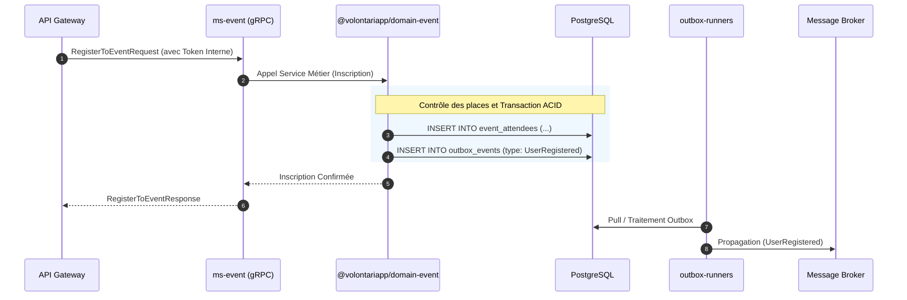

# Architecture & Design Document (ms-event & domain-event)

## Architecture Overview

Comme l'ensemble de la flotte backend de Volontariapp, `ms-event` implémente un couplage fort avec le module `@volontariapp/domain-event` pour sa logique métier, tout en appliquant les principes CQRS pour ses flux de données et le pattern Outbox pour sa gestion de l'état asynchrone.

## Directory Structure

### 1. Structure du Microservice (`ms-event`)

```text
ms-event/
├── src/
│   ├── config/          # Définitions de base (Data Sources, RPC)
│   ├── grpc/            # Mapping gRPC -> Couche métier
│   ├── modules/         # Assemblage NestJS
│   └── main.ts          # Bootstrap RPC
```

### 2. Structure du Domaine Partagé (`domain-event`)

```text
npm-packages/packages/domain-event/
├── src/
│   ├── entities/        # Entités (Event, Attendee, Location)
│   ├── value-objects/   # Objets porteurs de sémantique métier
│   ├── repositories/    # Interactions DB (TypeORM)
│   └── services/        # Orchestration métier complexe (ex: Gestion des quotas d'inscription)
```

## Data Flow & Component Communication



## Design Decisions & Trade-offs

1. **Extraction de la Logique Métier (`domain-event`)** : S'avère critique pour les workers spécialisés comme `post-processor-event` afin d'appliquer des traitements lourds (notifications de masse, recommandations croisées) sur des entités vérifiées sans faire d'aller-retours gRPC.
2. **Utilisation Native du Pattern Outbox** : Pour les événements de domaine, il est impératif que si l'inscription est validée (ex: réduction du compteur de places disponibles), le message parte dans le broker (pour l'analytique, les emails, etc.). TypeORM et `@volontariapp/outbox` verrouillent cela au niveau ACID.
3. **Architecture Headless** : Ce service ignore la topologie du client (web, mobile). Le Token Interne sert d'abstraction suffisante pour autoriser ou rejeter les requêtes selon les métadonnées de l'utilisateur.
